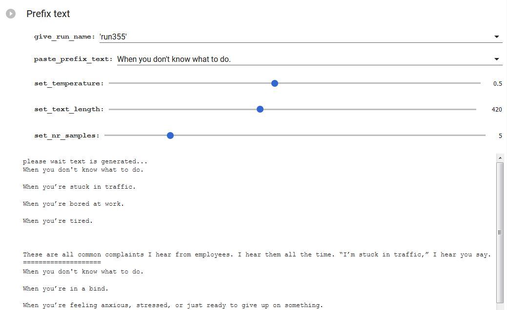

## Project Name

After a bit more than two years GPT3 is alife and kicking if you want to play with openAI API used for the Chatboot with the help of gradio package here is the [notebook](GPT-3-gradio-RevA.ipynb)

---
> 
Finetune a GPT-2 Text-Generating Model with prepared text. 
In this particual case text is concatenation of ten books  
from the field of Management, Leadership and good practices in Business. 
Start sentence was containing kind of contradiction to find out how finetuned model create a follow up 
355M model was used for tuning: 
Effects are really good.

##  Other examples with diffrent  prefixes which  are sometimes interesting, crude or surprising:

*   _You don't need to look behind  you to see solutions to problems; you can see them in the mirror. 
That helps you recognize the solutions you already have in your mind and moves you to action._
																																																						
*   _You don't need to look behind   you as you make your way up the ladder to know you are needed.  
You can recognize yourself in the crowd. 
You can tell when others are glancing at you, or judging you. You can be vulnerable. 
And if you’re trying to be strong, you are._

*   _Flexibility is the worst possible approach to leadership.  When you are the boss, you should be able to assign people and projects to whomever you want, 
when you want, for as long as you want. But you can’t  expect other people to do all the work for you. 
Of course, you can bring in people to assist, but that is a small step and not a big enough one. Start slowly and build your trust._

---

### General info
There are three released sizes of GPT-2:

* 124M (default): the "small" model, 500MB on disk.
* 355M: the "medium" model, 1.5GB on disk.
* 774M: the "large" model, cannot currently be finetuned with Colaboratory but can be used to generate text from the pretrained model (see later in Notebook)
*  1558M: the "extra large", true model. Will not work if a K80 GPU is attached to the notebook. (like 774M, it cannot be finetuned).
   Larger models have more knowledge, but take longer to finetune and longer to generate text. You can specify which base model to use by changing model_name.

## Exploring further possibilities of GPT2 
All the activities above are easiest option to get possibility of generating text in any language.
However, there is another option

Therefore, it often becomes necessary to have to train its own language model.

Nevertheless, training from scratch a powerful language model like GPT-2 or GPT-3 of OpenAI, BART of Facebook or T5 of Google requires tens or even hundreds of GB of text, which is impossible or difficult to find or requires power gigantic computing that only a few companies in the world have. For example,

[GPT-2 Extra-Large] (https://openai.com/blog/gpt-2-1-5b-release/)(1.5 billion parameters) was trained on 40GB of WebText on 32 Cloud TPU v3 for 1 week (cost of 43.008 dollars)
[CamemBERT, the BERT in French, was trained on 38GB of raw text on 256 GPUs (32 GB Tesla V100) for 1 day](https://github.com/huggingface/transformers/issues/1356#issuecomment-561691234)
[RoBERTa was pre-trained for 24 hours on 1,024 (full size, 32GB) V100s](https://github.com/huggingface/transformers/issues/1356#issuecomment-536187777)... and we are not talking about T5 or GPT-3 whose computational cost was estimated at 4.6 million of dollars! ("We are waiting for OpenAI to reveal more details about the training infrastructure and model implementation. But to put things into perspective, GPT-3 175B model required 3.14E23 FLOPS of computing for training. Even at theoretical 28 TFLOPS for V100 and lowest 3 year reserved cloud pricing we could find, this will take 355 GPU-years and cost 4.6M dollars for a single training run.")
NLP models through time, with their number of parameters (Image credit: TensorFlow blog)

Thus, as it is relatively easy to download a few GB of texts from an online language corpus ([Wikipedia](https://dumps.wikimedia.org/), OSCAR, Common Crawl for example) and rent a NVIDIA V100 GPU for $1.24 an hour (GCP, AWS, Azur for example), it is more realistic for the majority of people and organizations wishing to use a language model other than English to fine-tune on few GB of texts a model already pre-trained in English (i.e. fine-tuning a model obtained by Transfer Learning) using Deep Learning frameworks such as TensorFlow+Keras or PyTorch+fastai.

This tutorial show how to implement this second option and you will find examples of use for text generation in the paragraph Text Generation by our Polish GPT-2 at the end of this tutorial.

(option 2) Fine-tuning of an existing pre-trained model. For that purpose next three notebooks are used.
This will not be so simple because of the Quota of Colab environment.

## [After 3 years trying Open Source LLM](llm.MD)

## 1.  [wiki_download.ipynb](wiki_download.ipynb)
---

notebook is used for downloading wiki articules i n particular language as an output there is one txt aor csv file.
In this particular case it is 
1.1G	/content/gdrive/MyDrive/fastai/all_texts_plwiki.csv 

---
## 2.  [BPE_universal_tokenizer_pl.ipynb ](BPE_universal_tokenizer_pl.ipynb)

Tokeniser was prepared based on eglish tokeniser structure and polish wiki

---

## 3.  [finetuning-English-GPT2-language-Polish-HuggingFace-fastaiv2.ipynb ](finetuning-English-GPT2-language-Polish-HuggingFace-fastaiv2.ipynb)
Description of the steps are in the linked jupyter notebook.

### Technologies
* Python, 
* GPT-2 

### Setup
easiest is to install/update libraries accordnig to install secion in notebook

### Status
Project is: _in progress_ 

### Other information
Notebook is divided on universal fuctions whicht  could be easlily used elsewhere.

### Contact
Created by: _lencz.sla@gmail.com_

